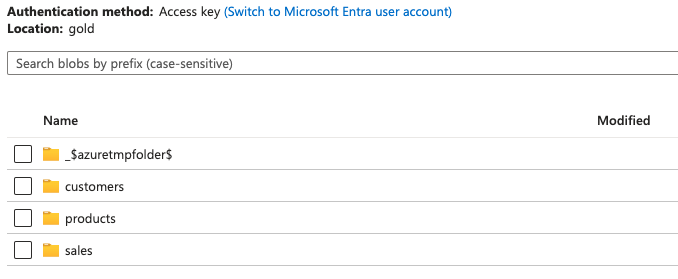

# Data Engineering using Azure Cloud, Databricks and dbt

## Overview

In today’s data-driven world, efficiently managing and processing the large volume of data is crucial for businesses seeking a competitive edge. Modern data engineering leverages cloud platforms and advanced tools to handle data at scale, ensuring it is accessible, reliable, and ready for the analysis. This blog outlines the principles, architecture, tools, and best practices for building a scalable, robust and efficient data pipeline using Azure Cloud services, Databricks, and dbt, structured around Medallion Architecture that transforms raw data into valuable insights.

## System Architecture


This Medallion architecture guarantees data integrity by subjecting it to multiple stages of validation and transformation, ensuring atomicity, consistency, and durability. After successfully passing these stages, the data is stored in an optimal format for effective analysis, making it ready for strategic decision-making. This modular architecture enables efficient large-scale data management and allows for agile adaptation to evolving requirements.

- <b>Bronze Layer:</b> This layer stores raw, unprocessed data ingested from various sources, such as SQL Server Databases. The data is stored in its original format , serving as a historical record of all ingested data. The table structures in this layer reflect those of the source systems in their initial state, with added metadata columns capturing details like load date/time and process ID. we will use Parquet files for adding new loaded data to this container.
- <b>Silver Layer:</b> The raw data from the Bronze layer is cleaned, validated, and enriched. The Silver layer offers an ‘Enterprise View’ of key business entities, concepts and transactions. The ELT methodology is followed, applying minimal transformations and data cleansing rules during the loading process, prioritising speed and agility in the ingestion and delivery of data into the data lake. For this project, we will develop slowly changing dimensions using dbt. The file format is Delta for this container.
- <b>Gold Layer:</b> The Gold layer contains transformed and aggregated data, optimised for analytics and reporting. We can store modeled data in Kimball’s star schema or Inmon style data marts, maintaining fact and dimension tables similar to traditional data warehouses. Data in this layer is ready for consumption by business intelligence tools and data scientists for advanced analytics. We will use dbt to aggregate different datasets together. The file format is Delta for this container as well.

## Tools and Technologies

1. Azure Data Factory
2. Azure Data Lake Storage (ADLS) Gen2
3. Azure SQL Database
4. Azure Key Vaults
5. Azure Databricks
6. dbt

## Dataset

The sample database `AdventureWorks LT` in Azure

## Data Engineering Workflow

1. <b>Set up services in Azure Cloud</b>
- Resource Group
- Azure Data Lake Storage Gen2
- Azure Data Factory
- Azure Key Vaults
- Azure SQL Database

2. <b>Setup Azure Data Factory</b>
- Create a linked service to connect ADF with Azure SQL Database
- Create a linked service to connect ADF with Azure Data Lake Storage Gen2
- Create a new dataset named as `TableQuery` using the AzureSqlDatabase1 linked service created above to fetch all tables contained in our database dynamically. This dataset is created without choosing the table name.


- Create a new dataset named as `SqlTable` using the AzureSqlDatabase1 linked service created above and add parameters for this dataset to save the schema name and table name dynamically from our database.


- Create a new dataset named `ParquetFileOutput` from AzureDataLakeStorage1 linked service. Ensure to pass in bronze into the Directory of the ParquetFileOutput configuration. The parameters FolderName and FileName will be kept empty.


3. <b>Setup Databricks</b>

- Link Azure Key Vaults to Azure Databricks: Create the secret from Azure Key Vaults and copy the Vault URI and Resource ID in Properties into the secret of Databricks.

- Mount an ADLS Gen2 filesystem to DBFS


- Create the database and tables

```bash
fileName = dbutils.widgets.get('fileName')
tableSchema = dbutils.widgets.get('table_schema')
tableName = dbutils.widgets.get('table_name')

spark.sql(f'create database if not exists {tableSchema}')

spark.sql("""CREATE TABLE IF NOT EXISTS """+tableSchema+"""."""+tableName+"""
           USING PARQUET
           LOCATION '/mnt/bronze/"""+fileName+"""/"""+tableSchema+"""."""+tableName+""".parquet'
         """)
```

- Create access token to connect with ADF via a linked service

4. <b>Create a pipeline and activities in Azure Data Factory</b>

- Lookup activity: fetch all records from our database based on the Query added in the Settings. It will be configured using TablesQuery dataset. The results will return the array of table_catalog, table_schema, table_name, and table_type.

```bash
select * from [your database name].information_schema.tables
where table_schema = 'SalesLT' and table_type = 'BASE TABLE'
```

- Copy data activity: copy all data from `SalesLT` schema and dump the data into the `bronze` layer.

- Notebook activity: create data in Azure Databricks


5. <b>dbt transformation</b>

- Set up dbt project

    - Run `dbt init` to set up our dbt project. The server hostname and HTTP path is collected from our Databricks cluster Compute > Advanced options > JDBC/ODBC. To verify our setup is correct, run `dbt debug`
    - Create models/staging/`bronze.yml` : list all tables that make up our source and populate the data into the `silver` layer.
    - Run `dbt snapshot` command to execute the Snapshots defined in our dbt project.
    
- Integration logic for gold layer: create denormalised tables `dim_customer`, `dim_product`, `sales` in `marts` directory.
- Run `dbt run` command and observe the data in Databricks and the `gold` layer.




- View the lineage graphs of each of the transformations in dbt.


